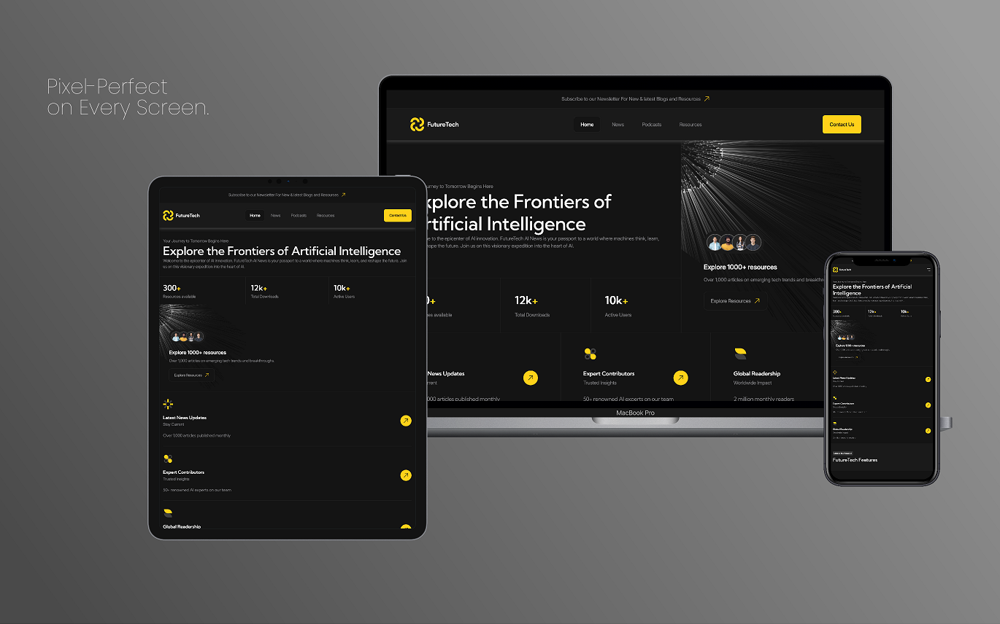

# Future Tech

A modern, highly interactive multi-page website built with a focus on advanced responsiveness, cutting-edge UI components, and clean architectural patterns.

[🚀 Live Demo](https://conmind.github.io/future-tech/) | [📁 Repository](https://github.com/conmind/future-tech) | [🐛 Report Bug](https://github.com/conmind/future-tech/issues)

---

 

---

### 🛠 Tech Stack & Methodology

Here are the core technologies, tools, and structural approaches used to build this application:

          

*   **Component-Driven Architecture:** Style sheets and scripts are isolated into independent, reusable modules.
*   **BEM Methodology:** Strict naming convention ensuring highly maintainable, scalable, and conflict-free CSS.
*   **Sass (SCSS):** Advanced styling leveraging variables, mixins, nesting, and structured partial files.

---

Future Tech is a comprehensive multi-page platform. Each view is meticulously optimized for performance and semantic structure:

*   **Home Page (`index.html`):** The central hub introducing core tech concepts, featuring interactive hero sections, and highlights.
*   **Tech News (`news.html`):** A dynamic grid-based layout delivering the latest tech updates and breaking industry stories.
*   **Insights Blog (`blog.html`):** A well-structured article feed with scalable typography, reading optimized styles, and author insights.
*   **Resource Library (`resources.html`):** A curated hub for guides, downloadable assets, and documentation with clean data layouts.
*   **Media & Podcasts (`podcasts.html`):** A custom media-focused page designed for audio streaming content and episode tracking.
*   **Get in Touch (`contacts.html`):** Dedicated communication page equipped with validated form interfaces and responsive contact details.

### 🧩 Core Features & Advanced Interactive UI

The project contains a rich set of custom-built interactive components, showcasing deep integration between DOM manipulation and state management:

*   📱 **Fluid Responsive Layout:** Flawless adaptive grid shifting across mobile, tablet, desktop, and ultra-wide 4K screens.
*   🍔 **Interactive Navigation:** Smooth, accessibly designed hamburger overlay menu for handheld devices.
*   🗂 **Dynamic Tab Interfaces:** Fast content-switching components with custom state handling.
*   🔼 **Accordion Components:** Smooth slide-and-collapse toggles for FAQs and structured data layouts.
*   ⚡ **JS Breakpoint Tracking:** Advanced resize listeners in JavaScript dynamically tailoring interactive UI states based on active viewport conditions.
*   🔄 **Reactive UI & Proxies:** JavaScript `Proxy` objects managing app state and automatically updating UI elements reactively upon data mutations.

---

### 🚀 Getting Started

To run this project locally, make sure you have [Node.js and npm](https://nodejs.org) installed.

1. **Clone the repository:**
   ```bash
   git clone https://github.com/conmind/future-tech
   ```

2. **Navigate into the project folder:**
   ```bash
   cd future-tech
   ```

3. **Install dependencies:**
   ```bash
   npm install
   ```

4. **Start the development environment & view the site:**
   * **Step 4A:** Run the Sass compiler to watch and build your styles in real-time:
     ```bash
     npm run sass-watch
     ```
   * **Step 4B:** Open `index.html` directly in your favorite browser (or use the VS Code *Live Server* extension) to view the live site.


### 📁 Project Structure

```text
future-tech/
├── fonts/                          # Platform typography (.woff2 files)
├── icons/                          # UI icons, asset graphics, and favicons (.svg, .ico)
├── images/                         # Project image assets grouped by page sections
├── scripts/                        # JavaScript module architecture and reactive UI logic
│   ├── utils/                      # Helper utilities and calculation functions
│   └── *.js                        # Core components (Tabs, Accordions, Proxy state, etc.)
├── styles/                         # SASS (SCSS) styling architecture
│   ├── helpers/                    # Mixins, media-queries, and functions
│   ├── blocks/                     # Independent BEM component/block styles
│   └── main.scss                   # Main entry point for the Sass compiler
├── *.html                          # Platform pages (index, news, blog, resources, etc.)
├── package.json                    # Project configuration, metadata, and npm scripts
└── README.md                       # Project documentation
```

<details>
<summary><b>🔍 View Detailed Directory Tree (Full Blueprint)</b></summary>

```text

future-tech/
├── .github/                        # GitHub configurations, CI/CD workflows, and core assets
│   ├── images/                     # Graphical assets and banners used for README markdown
│   └── workflows/                  # Automated GitHub Actions CI/CD deployment scripts
├── .gitignore                      # Git exclusion rules
├── package.json                    # Dependencies & npm scripts
├── package-lock.json               # Locked dependency versions
├── README.md                       # Main documentation
│
├── *.html                          # Comprehensive multi-page views (index, blog, contacts,
│                                     news, podcasts, resources)
│
├── fonts/                          # Global fonts (Inter, Kumbh Sans)
├── icons/                          # Semantic SVG icons & website favicons
├── images/                         # Image assets organized by section (about, blog, features, team, etc.)
│
├── scripts/                        # Component-driven JavaScript architecture
│   ├── BaseComponent.js            # Core abstract class handling reactive UI updates via JavaScript Proxy
│   ├── MatchMedia.js               # Advanced JS breakpoint tracking and runtime viewport listeners
│   ├── ExpandableContent.js        # Smooth accordion and spoiler UI toggles
│   ├── Header.js                   # Navigation bar control (scroll tracking & mobile hamburger overlay)
│   ├── InputMask.js                # Custom text field validation overlays and masks
│   ├── Select.js                   # Dynamic, accessible custom dropdown selects
│   ├── Tabs.js                     # Interactive tab switching with decoupled state
│   ├── VideoPlayer.js              # Fully custom media player controller
│   ├── main.js                     # Application entry point & module initializer
│   └── utils/
│       └── pxToRem.js              # Dynamic fluid typography helper (Pixels to REM)
│
└── styles/                         # Modular SASS/SCSS styling architecture
    ├── main.scss                   # Global compilation orchestrator
    ├── _fonts.scss                 # Typography integration rules
    ├── _globals.scss               # Baseline HTML elements & layout setup
    ├── _normalize.scss             # Cross-browser CSS normalization
    ├── _utils.scss                 # Utility-first helper layout classes
    ├── _variables.scss             # Design tokens (color palette, fluid grid, spacing)
    │
    ├── helpers/                    # SASS engineering utilities
    │   ├── _functions.scss         # Layout & mathematical functions
    │   ├── _media.scss             # Responsive design mixins (media queries core)
    │   └── _mixins.scss            # Reusable styling injection templates
    │
    └── blocks/                     # Encapsulated BEM component files (60+ UI components compiled)
```
</details>

---

### 📜 Credits & Acknowledgements

*   This project was built as part of a masterclass by **Aleksander Lamkov** on YouTube. 
*   Original Masterclass: [Watch the Tutorial](https://www.youtube.com/watch?v=hkYzqTKnSIg)


### 📬 Contact

Developed by **conmind**  
*   **GitHub:** [@conmind](https://github.com/conmind)